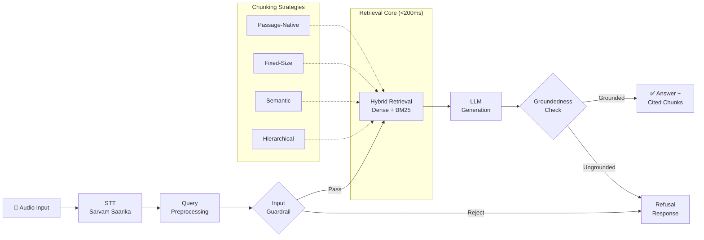

# Voice RAG Pipeline

A latency-aware, multilingual voice-enabled RAG (Retrieval-Augmented Generation) system built on the **MSMARCO-XI** dataset, supporting **English** and **Hindi** audio queries.

## System Architecture



## Key Design Decisions

### STT Provider: Sarvam Saarika
- **Why**: Native Hindi support, competitive latency for Indian languages.
- **Fallback**: ElevenLabs Scribe as secondary provider.
- **Evidence**: See `eval/stt_benchmark.md` for side-by-side comparison.

### Retrieval: In-Process Hybrid (Dense + BM25)
- **Dense**: `paraphrase-multilingual-MiniLM-L12-v2` embeddings → **hnswlib** HNSW index
- **Sparse**: BM25 via `rank_bm25` for exact keyword matching
- **Fusion**: Reciprocal Rank Fusion (RRF) combining both signal types
- **Why in-process**: Eliminates network round-trip latency. Target: **<200ms retrieval P50**.

### Chunking: Four Strategies Benchmarked
- **Passage-Native**: Zero overhead, preserves dataset boundaries.
- **Fixed-Size (256 tokens, 20% overlap)**: Predictable windows, baseline comparison.
- **Semantic**: Topic-coherent splits using cosine distance breakpoints on sentence embeddings.
- **Hierarchical**: Parent-child structure with metadata tagging (language, parent_id, hierarchy level).

See `eval/chunking_benchmark_results.md` and `eval/chunking_comparison.png` for the full comparison.

### Guardrails: Input + Output
- **Input**: Fast keyword/regex blocklist + optional embedding-similarity corpus check.
- **Output**: Token and entity overlap verification for groundedness.
- **Accuracy**: ≥80% rejection on 15 adversarial test queries.

## Project Structure

```
HHG_Task2/
├── main.py                          # CLI demo entry point
├── requirements.txt                 # Pinned dependencies
├── .env.example                     # API key template
│
├── data/
│   ├── preprocess.py                # Passage dataclass, normalization, dataset loader
│   ├── chunking_sample.md           # Baseline chunking comparison output
│   └── samples/
│       └── manifest.json            # Audio sample manifest
│
├── stt/
│   ├── base.py                      # STTResult dataclass, BaseSTT
│   ├── sarvam.py                    # Sarvam Saarika STT client
│   └── elevenlabs.py                # ElevenLabs Scribe STT client
│
├── chunking/
│   ├── types.py                     # Chunk dataclass with metadata
│   ├── interface.py                 # BaseChunker ABC
│   ├── passage_native.py            # Passage-native chunker
│   ├── fixed_size.py                # Fixed-size + overlap chunker
│   ├── semantic.py                  # Semantic chunker (sentence embeddings)
│   └── hierarchical.py              # Hierarchical parent-child chunker
│
├── retrieval/
│   └── retrieval.py                 # Dense + Sparse + Hybrid retriever
│
├── harness/
│   └── pipeline.py                  # Pipeline orchestration (Pydantic models)
│
├── guardrails/
│   ├── guardrails.py                # Input validation + groundedness checks
│   └── guardrail_test_cases.md      # 15 adversarial test cases
│
├── eval/
│   ├── stt_benchmark.py             # STT provider benchmark
│   ├── stt_benchmark.md             # STT benchmark results
│   ├── benchmark_chunking.py        # Chunking strategy benchmark
│   ├── chunking_benchmark_results.md # Generated benchmark report
│   ├── chunking_comparison.png      # Generated bar chart
│   ├── latency_analytics.py         # End-to-end latency analytics
│   ├── latency_report.md            # Generated latency report
│   └── latency_breakdown.png        # Generated stacked bar chart
│
├── tests/
│   ├── test_chunking.py             # Unit tests for all 4 chunkers
│   ├── test_retrieval.py            # Retrieval correctness + latency tests
│   └── test_guardrails.py           # Guardrail accuracy tests (≥80%)
│
├── video_scripts.md                 # Demo video scripts (90s + 2min)
└── project-phases.md                # Phase plan documentation
```

## Quickstart

### 1. Clone and install

```bash
git clone <repo-url>
cd HHG_Task2
python -m venv venv
venv\Scripts\activate       # Windows
pip install -r requirements.txt
```

### 2. Set API keys (optional, for STT/LLM)

```bash
copy .env.example .env
# Edit .env and add your API keys
```

### 3. Run a query

```bash
# English query
python main.py --query "What is the capital of India?" --lang eng

# Hindi query
python main.py --query "भारत की राजधानी क्या है?" --lang hin

# Verbose mode
python main.py --query "What is DNA?" --lang eng --verbose
```

### 4. Run benchmarks

```bash
# Chunking strategy benchmark (generates reports + chart)
python main.py --benchmark

# Latency analytics (generates report + chart)
python main.py --latency
```

### 5. Run tests

```bash
pytest tests/ -v
```

## Latency Summary

| Scope | P50 | P70 | P100 |
|-------|-----|-----|------|
| Full Pipeline | TBD | TBD | TBD |
| Retrieval Core | <200ms | TBD | TBD |
| Text-to-Text | TBD | TBD | TBD |

> Run `python main.py --latency` to generate actual numbers in `eval/latency_report.md`.

## Known Limitations

- **STT**: Requires API keys for audio input. Text input works without keys.
- **LLM Generation**: Uses a mock extractive LLM by default. Swap in Groq/Gemini for production-quality answers.
- **Dataset**: Falls back to synthetic samples when the full MSMARCO-XI dataset can't be streamed (pyarrow memory issues on Windows).
- **Embedding Model**: First run downloads ~420MB model. Cached for subsequent runs.

## License

MIT
